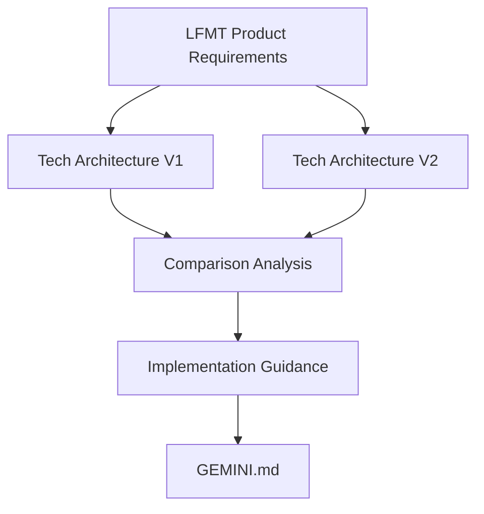

# GEMINI.md

This file provides guidance to Gemini when working with code in this repository.

## Project Overview

This repository contains documentation for a **Long-Form Translation Service** Proof of Concept (POC) that translates 65K-400K word documents from Project Gutenberg using Gemini API. The system is designed to handle documents that exceed LLM context windows through intelligent chunking and reassembly strategies.

**Key Technical Challenge**: Process documents up to 400K words within Gemini's context window while maintaining translation coherence.

## Repository Structure & Documentation

This Obsidian vault contains the following key documents:

### Core Documentation
- `LFMT Product Requirements.md` - Complete product specification and success criteria
- `Long-Form Translation Service - Technical Architecture Design.md` - **V1** technical architecture
- `Long-Form Translation Service - Technical Architecture Design v2.0.md` - **V2** enhanced technical architecture (recommended)
- `Technical Architecture Comparison Analysis.md` - Detailed comparison between V1 and V2
- `Welcome.md` - Obsidian vault introduction

### Documentation Evolution
The technical architecture has evolved from V1 to V2 with significant improvements:
- **V2 is the recommended implementation guide** with polling-only architecture
- V1 provides historical context and additional detail on error handling and disaster recovery
- See [[Technical Architecture Comparison Analysis]] for detailed differences

## Project Type and Architecture

This is a **documentation-only repository** containing:
- Product Requirements Specification 
- Technical Architecture Design documents (v1.0 and v2.0)
- Project planning documentation

The actual codebase implementation will be built based on these specifications using:

### Planned Technology Stack
- **Frontend**: React 18 SPA with TypeScript, Material-UI, hosted on CloudFront
- **Backend**: AWS serverless architecture (Lambda, Step Functions, ECS Fargate)
- **Translation Engine**: Gemini API with intelligent document chunking
- **Storage**: S3 for files, DynamoDB for metadata and legal attestations
- **Authentication**: AWS Cognito with JWT tokens

### Core Architecture Components
1. **Document Chunking Engine**: Splits large documents into 3,500-token chunks with 250-token overlap
2. **Context Management**: Sliding window approach to maintain translation consistency across chunks  
3. **Legal Attestation System**: Production-ready storage for copyright compliance (7-year retention)
4. **Progress Tracking**: Polling-based architecture (simplified from original WebSocket design)
5. **Rate Limiting**: Gemini API compliance with exponential backoff

## Key Implementation Details

### Translation Processing
- **Chunk Size**: 3,500 tokens primary content + 250 tokens context
- **Languages Supported**: Spanish, French, Italian, German, Chinese
- **Processing Time**: 30-60 min (65K words) to 2-6 hours (400K words)

### Cost Targets
- **Monthly Budget**: <$50 for 1000 translations
- **Cost per Translation**: <$0.05 for 100K word document
- **Primary Cost Driver**: Gemini API calls

### Legal Compliance
- **Attestation Storage**: DynamoDB with 7-year TTL + S3 Glacier archival
- **Required Statements**: Copyright ownership, translation rights, liability acceptance
- **Audit Trail**: Comprehensive logging with IP tracking and document hashing

## Implementation Guidelines

### Architecture Decisions (V2 Improvements)
- **Use V2 architecture as primary reference** - includes polling-only design and enhanced legal compliance
- **Consult V1 for missing sections** - particularly error handling and disaster recovery procedures  
- **Follow V2's simplified approach** - REST API over WebSocket for reduced complexity

### Development Best Practices
1. **Security First**: Never log or expose API keys, implement comprehensive input validation
2. **Cost Monitoring**: Track Gemini API usage closely, implement automatic alerts at 80% of budget  
3. **Legal Compliance**: Ensure all file uploads have valid legal attestations before processing
4. **Error Handling**: Implement robust retry logic with exponential backoff for Gemini API
5. **Progress Tracking**: Use polling with adaptive intervals (15s → 30s → 60s based on elapsed time)

### Missing Sections to Implement
Based on [[Technical Architecture Comparison Analysis]], V2 lacks some critical sections from V1:
- **Error Handling & Recovery**: Implement comprehensive failure scenarios and data consistency procedures
- **Disaster Recovery**: Add backup strategies and business continuity planning
- **Distributed Tracing**: Consider X-Ray integration for debugging and performance monitoring

## Architecture Decisions Made

1. **Polling over WebSocket**: Simplified approach for POC, eliminates session timeout complexity
2. **ECS Fargate for Processing**: Long-running translation jobs with auto-scaling
3. **ARM64 Architecture**: 20% cost savings on compute resources
4. **Production-Ready Legal Storage**: Full compliance infrastructure despite POC nature

## Success Metrics

- **Translation Quality**: >90% successful chunk processing with coherent reassembly
- **Performance**: Processing within 150% of estimated time for 80% of jobs
- **Reliability**: <5% permanent processing failures
- **Cost Efficiency**: Actual costs within 120% of estimates

## Testing Strategy

When implementing tests:
- **Unit Tests**: Focus on chunking algorithm and context management
- **Integration Tests**: End-to-end workflow including legal attestation
- **Load Tests**: 5 concurrent users processing various document sizes  
- **Legal Compliance Tests**: Attestation validation and audit trail verification
- **Polling Performance Tests**: Adaptive interval validation and API response time testing

## Implementation Guidance

### Development Verification
- Always try to verify implementation whenever possible.

## Obsidian Vault Organization

### Recommended Practices for This Vault
- Use `[[Document Name]]` for internal links between architecture documents
- Tag sections with relevant topics using `#tag` format for easy navigation
- Create MOCs (Maps of Content) for complex topics spanning multiple documents
- Use callouts for important warnings: `> [!WARNING] Critical Implementation Note`

### Key Relationships

### Cross-References
- Product requirements drive technical decisions in both [[Long-Form Translation Service - Technical Architecture Design]] and [[Long-Form Translation Service - Technical Architecture Design v2.0]]
- Implementation should primarily follow V2 with V1 consultation for missing sections as detailed in [[Technical Architecture Comparison Analysis]]

---

*This documentation vault is optimized for Obsidian's linking and graph view capabilities. Use the graph view to explore relationships between concepts and documents.*